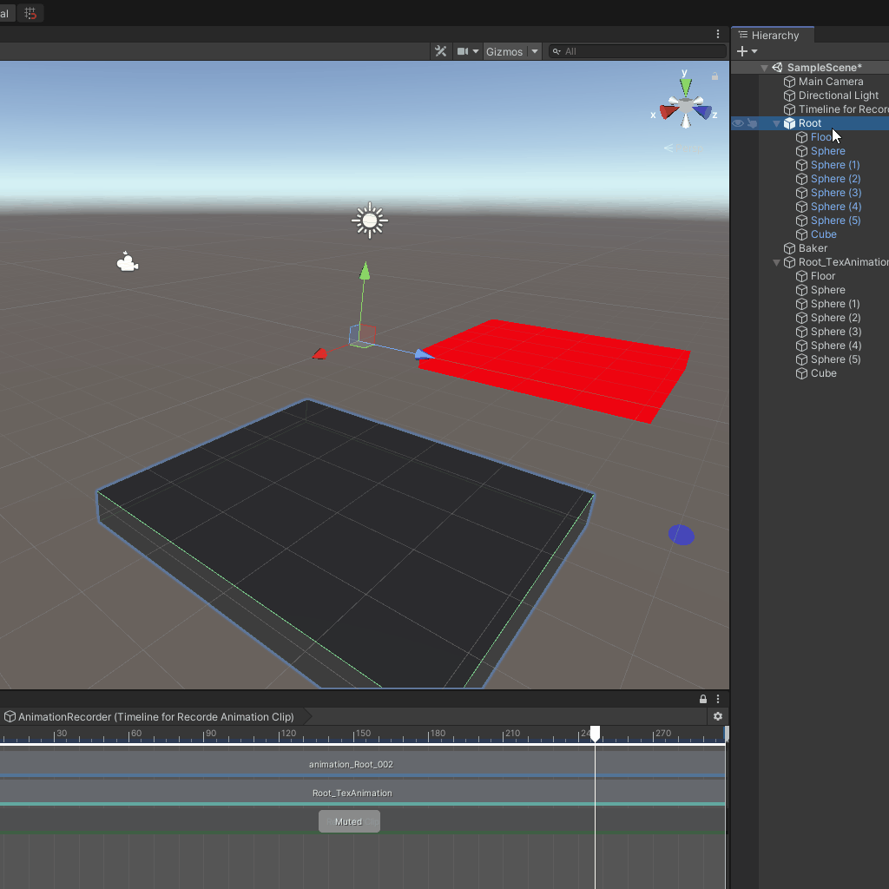
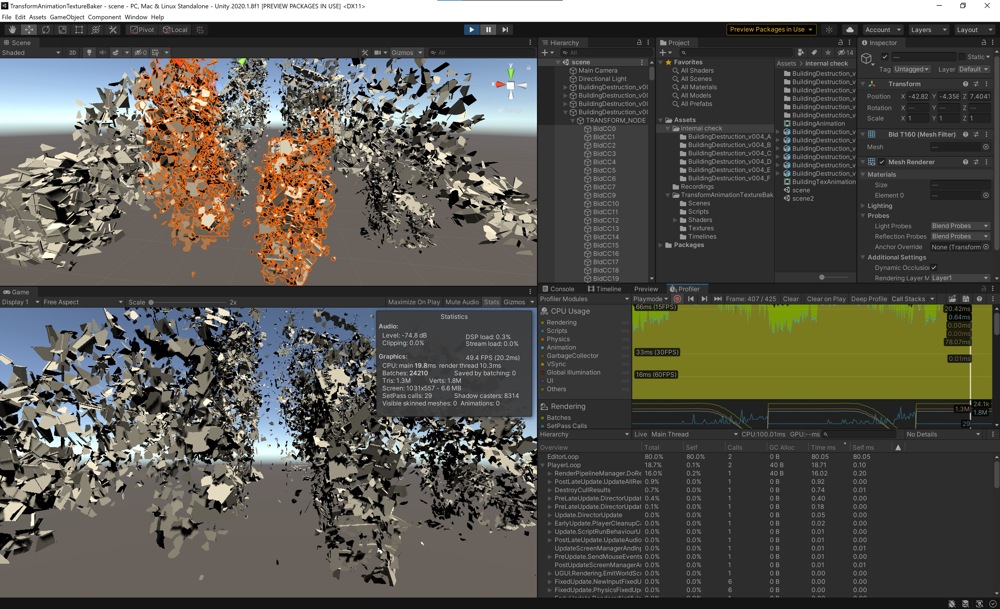
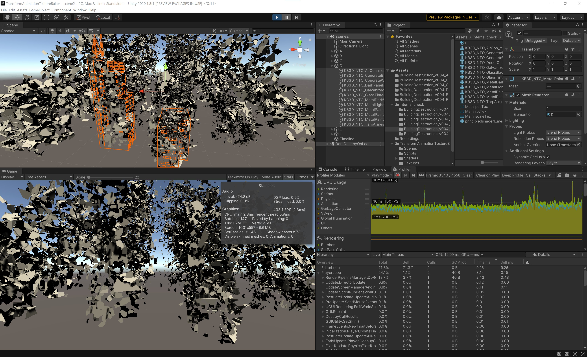

# Transform-Animation Texture Baker

Baking Object's Position/Rotation/Scale Animation to Texture, and Play via Shader

## Optimization

- Writing Object Index to mesh.uv2
- Combine meshes per Materials to reduce Draw Call

### Unity Built-in Animation 

- FPS:49.4
- Batches: 24210

Thousands of objects are Animate via AnimationClip (Tons of AnimationCurves) is too heavy

### Bake Transform-Animation to Texture, and Combine Meshes

- FPS: 433.1
- Batches: 147

Building-Destruction animation is created by [Yuya Torii](https://github.com/toriivfx), not included in this repo
