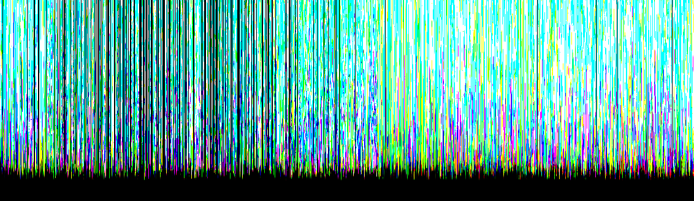
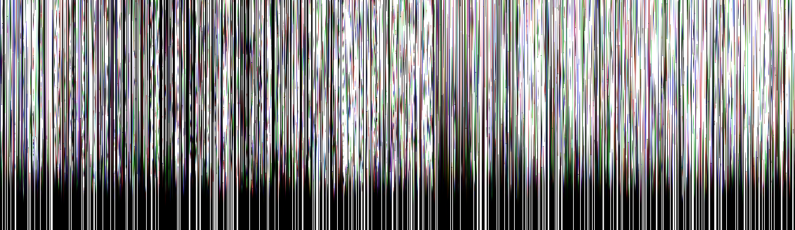

# Transform-Animation Texture Baker

Baking Object's Position/Rotation/Scale Animation to Texture, and Play via Shader

## Optimization

- Writing Object Index to mesh.uv2
- Combine meshes per Materials to reduce Draw Call

### Unity Built-in Animation 

- FPS:49.4
- Batches: 24210

Thousands of objects are Animate via AnimationClip (Tons of AnimationCurves) is too heavy

### Bake Transform-Animation to Texture, and Combine Meshes

- FPS: 433.1
- Batches: 147

### [Output Textures](https://github.com/sugi-cho/TransformAnimationTextureBaker/blob/main/Assets/TransformAnimationTextureBaker/Scripts/TransformAnimationTextureBaker.cs#L41-L55)

#### Texture of positions `Vector3`

#### Texture of rotations `Quaternion`

#### Texture of scales `Vector3`

Building-Destruction animation is created by [Yuya Torii](https://github.com/toriivfx), not included in this repo
